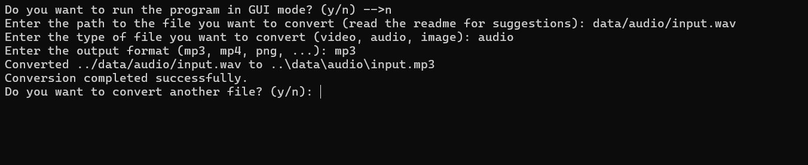
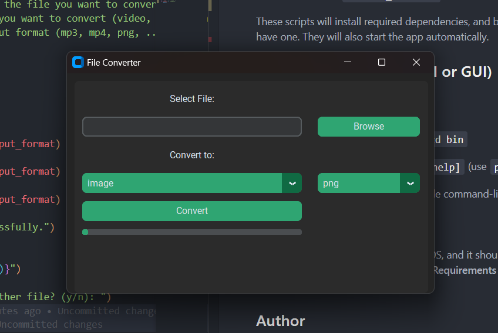

# Special-happiness-converter

## Description

This is a simple program that converts 3 types of file: audio, image, video.

Example of extension: .mp3, .jpg, .mp4

It can possibly convert any extension of the 3 types of file,
but it is not guaranteed that the file will be converted correctly.

Whre to put the files:

- audio: in the audio folder ("data/audio")
- image: in the image folder ("data/image")
- video: in the video folder ("data/video")

Where the converted files will be:
in the same folder as the original file, same name but with the extension changed.

Why is it called Special-happiness-converter?
Because it is a special program that converts files and makes you happy.

## Requirements

python >= 3.8

**Setting Up the Environment**

* Windows: `./start_Windows.bat`
* Linux/macOS: `./start_Linux.sh`

These scripts will install required dependencies, and build a virtual environment for you if you don't have one.
They will also start the app automatically.

## Running the Program (CLI or GUI)

### CLI

1. Navigate to the `bin` directory: `cd bin`

2. Execute `python router.py [--help]` (use `python3` on Linux/macOS) in your terminal

    The `--help` flag displays available command-line arguments.

### GUI

Double click on the *start files* for your OS, and it should open a windows with a question after setting up the environment, like I wrote in the **Requirements** area. The window asks you to choose between the CLI and GUI.

## Author

Neetre 2024
